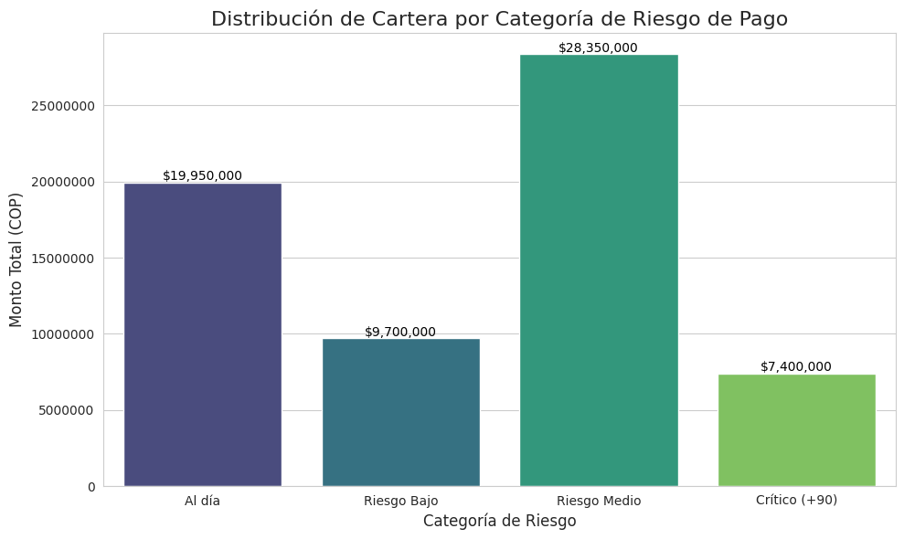

# 📊 SAP Financial Intelligence: Optimización de Flujo de Caja y Riesgo de Cartera
> **De Consultora Funcional SAP a Estratega de Datos Senior**

## 🎯 El Problema de Negocio
En entornos ERP complejos, la visibilidad inmediata de la liquidez es un reto crítico. Este proyecto soluciona la necesidad de monitorear la salud de las **Cuentas por Cobrar (AR)** mediante la automatización del análisis de **Aging (Antigüedad de deuda)**, permitiendo a la tesorería priorizar esfuerzos de cobranza y reducir el DSO.

## 🛠️ Expertise Técnico e Integración
Para este análisis, utilicé una metodología híbrida que combina el corazón del negocio con tecnología moderna:

* **Extracción & Contexto SAP:** Simulación de datos basada en tablas reales de partidas abiertas y compensadas (**BSID / BSAD**) y datos maestros de clientes (**KNA1**).
* **Procesamiento con Python (Pandas):** * Cálculo automatizado de **Days Sales Outstanding (DSO)**.
    * Categorización de deuda en "Buckets" de riesgo (0-30, 31-60, 61-90, +90 días).
    * Limpieza y normalización de montos financieros.
* **Visualización Ejecutiva (Seaborn/Matplotlib):** Creación de un Dashboard de riesgo de liquidez.

## 📈 Resultados Visuales (Insight de Negocio)
A continuación, se presenta la distribución del riesgo de cartera procesada automáticamente desde el script de Python:

### Hallazgos Clave:
* **Alerta de Liquidez:** Identificación de **$7.4M** en estado Crítico (+90 días) que requieren intervención legal o de cobranza inmediata.
* **Concentración de Riesgo:** El volumen crítico en "Riesgo Medio" sugiere una demora sistémica que podría impactar el flujo de caja del próximo mes.

## 🚀 Valor Agregado como Freelance
No solo entrego un gráfico; entrego una **solución de eficiencia**. Este script permite:
1.  Reducir el tiempo de generación de reportes de horas a **segundos**.
2.  Identificar exactamente qué clientes requieren una llamada de cobranza hoy mismo.
3.  Optimizar la política de crédito basada en datos reales de comportamiento de pago.

---
**Nathaly Moreno** *Consultora Senior SAP | Data Analyst* [LinkedIn](TU_LINK_DE_LINKEDIN_AQUI) | [Email](mailto:moreno.nathaly713@gmail.com)

